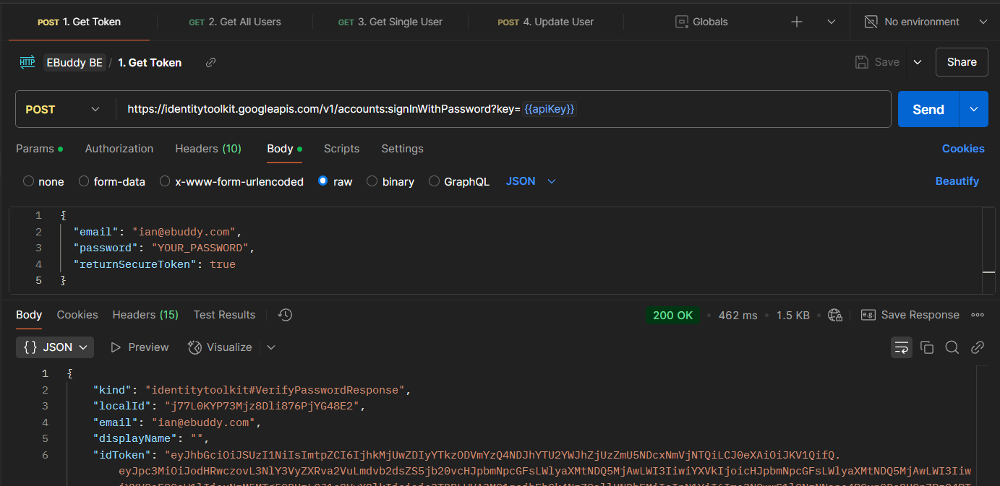
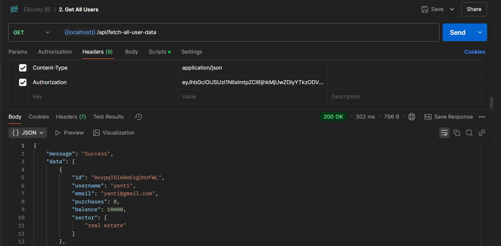
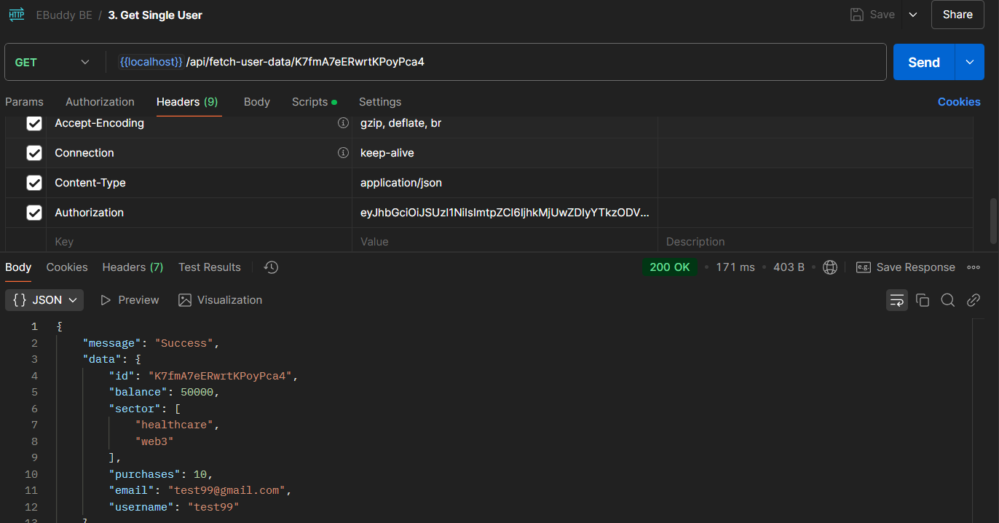
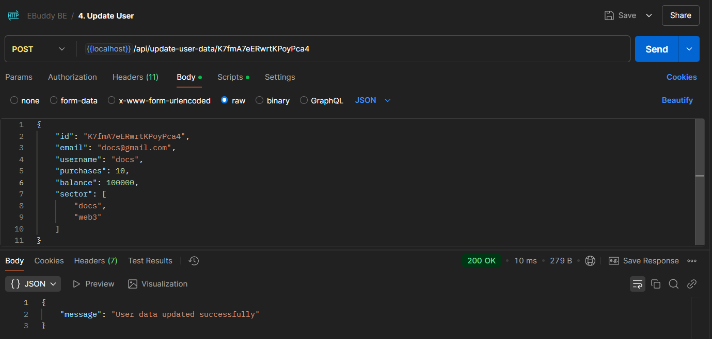
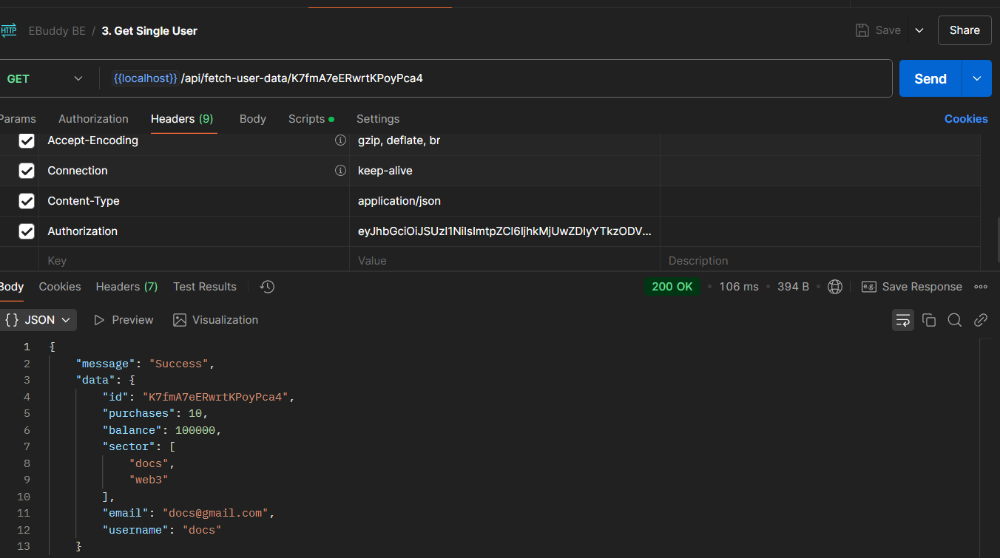

# README

## Backend System for Ebuddy Test

### Project Setup

To start this backend, we should configure the Firebase Service Account Key and the PORT that we want to use. You can store them within your `.env` file. The following is the example of my `.env`

```.env
EXPRESS_PORT=8080
```

and the following is the example of `Firebase Service Account` in JSON

```JSON
{
  "type": "value",
  "project_id": "value",
  "private_key_id": "value",
  "private_key": "value",
  "client_email": "value",
  "client_id": "value",
  "auth_uri": "value",
  "token_uri": "value",
  "auth_provider_x509_cert_url": "value",
  "client_x509_cert_url": "value",
  "universe_domain": "valuem"
}
```

To start the service, do the following steps:

1. `npm i`
2. `npm run dev`
3. Login to your app account (stored in Firebase Authentication) in Postman through this link `https://identitytoolkit.googleapis.com/v1/accounts:signInWithPassword?key={{apiKey}}`
4. Put the `apiKey` value into the `signInWithPassword?key=`
5. Put your email and password into the `body` of the request
6. Retrieve the `idToken` (JWT Structure)
7. Use the `idToken` on every Authorization Headers and use all of this API services

The BE Service should work in `https://localhost:8080`. You can try it using the postman collection in the `root` folder.

#### Routes

1. Fetch All User - `api/fetch-all-user-data`
2. Fetch Single User - `api/fetch-user-data:id`
3. Update User - `update-user-data:id`

### Response Example

#### Get Token



#### Fetch All Users



#### Fetch Single User



#### Update User

Update User


Update Result

