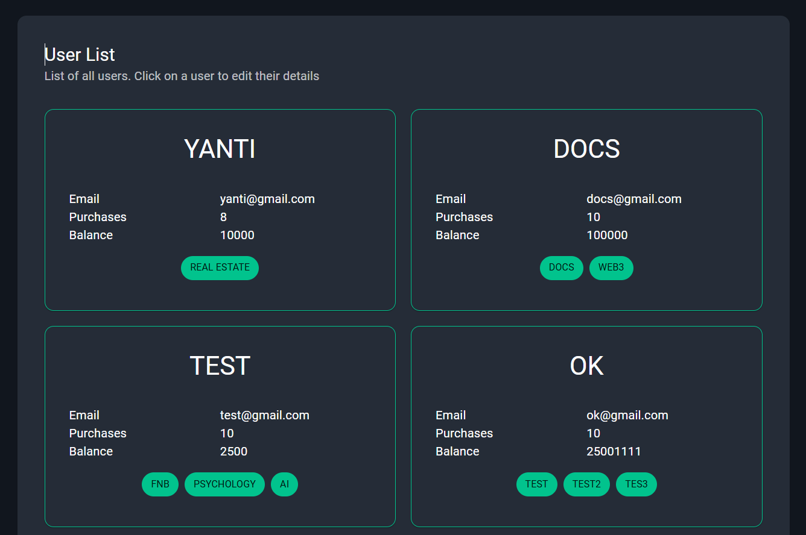
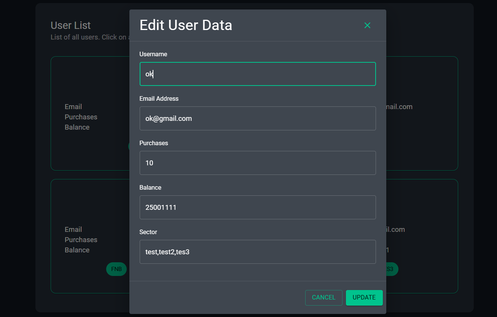
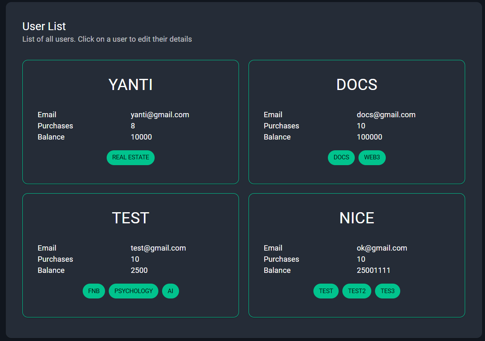
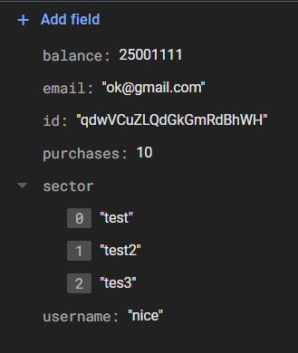

# README

## Frontend System for EBuddy Test

### Project Structure

```bash
public
└───src
    ├───apis
    │   ├───auth
    │   │   └───login
    │   └───user
    ├───app
    │   ├───auth
    │   │   └───login
    │   │       └───utils
    │   ├───home
    │   │   └───utils
    │   └───_firebase
    ├───components
    │   ├───auth
    │   ├───home
    │   └───modal
    ├───layout
    ├───store
    │   └───slices
    ├───theme
    ├───types
    └───utils
```

| Folder       | Description                                                                                                                                                        |
| ------------ | ------------------------------------------------------------------------------------------------------------------------------------------------------------------ |
| `apis`       | This folder used to handle all API call to the backend                                                                                                             |
| `apis/auth`  | Handles the Login Authentication and set the `idToken` to the Cookie                                                                                               |
| `apis/user`  | Handles all CRU operations within the application. Including fetch all, fetch single, and update user                                                              |
| `app`        | All Server Actions and `page.tsx` files of the project (routing). This folder also includes the configuration of the Firebase which is stored in private directory |
| `components` | All Atomic Copmonents used in the app. I use this folder to separate the Header, Form, and Card                                                                    |
| `layout`     | Customised Layout for the Application                                                                                                                              |
| `store`      | Redux Configuration                                                                                                                                                |
| `theme`      | MUI Configuration                                                                                                                                                  |
| `types`      | Entities used in the Backend                                                                                                                                       |
| `utils`      | Extra utils for me to get the token stored in the browser                                                                                                          |

### Middleware & Auth Schema

At the first render, the app will check the middleware and check the current state of the user by inspecting their current path. If they're inside of the protected path, it'll automatically redirected to the `auth/login`

The following is the application schema with the backend for the authentication


This schema starts with:

1. The user asks for the `idToken` (Login to Firebase Authentication)
2. Firebase gives the user the `idToken`
3. The `idToken` needs to be verified first before it's used as the Browser's Cookie
4. The user send the `idToken` to Backend to validate the token
5. The backend will validate it by sending the token to Firebase to ensure the token is a valid token
6. After validate it, the `idToken` will be returned to the user
7. The validated `idToken` is stored on the Cookie
8. User can access `/home`

### App Screenshots





